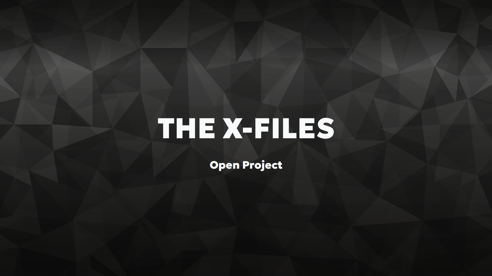
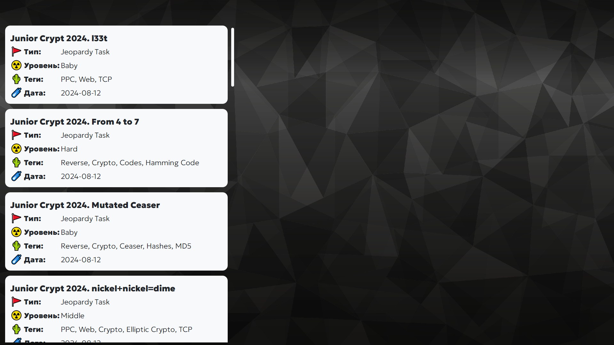
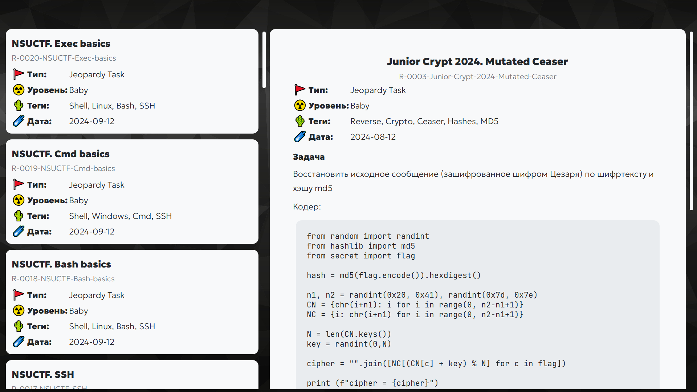
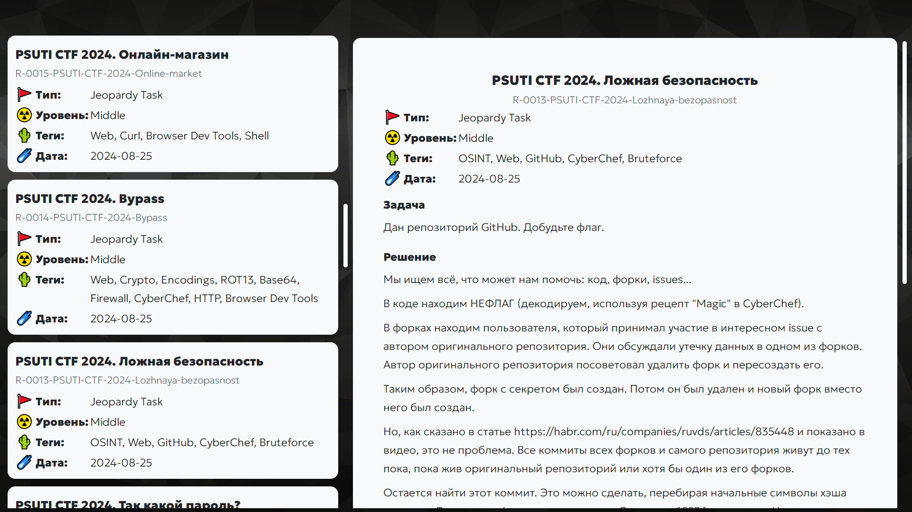
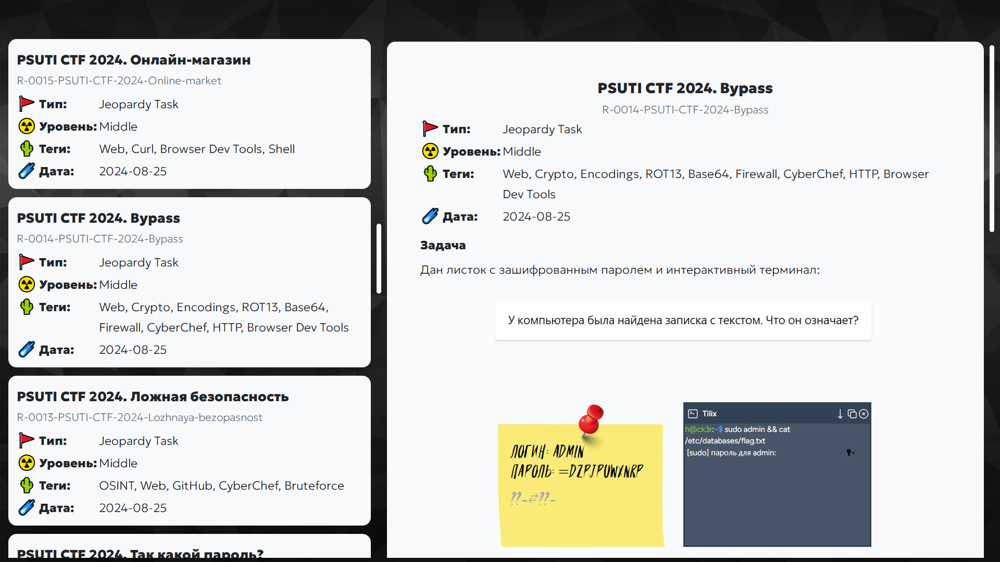
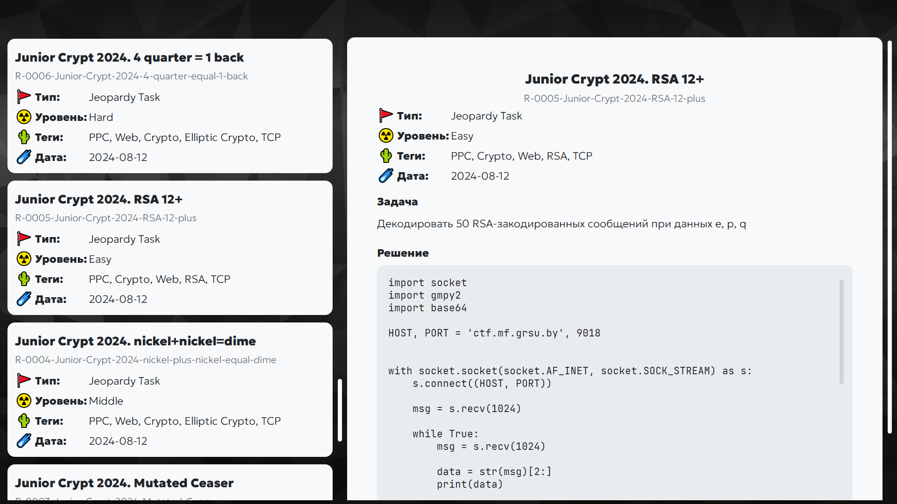
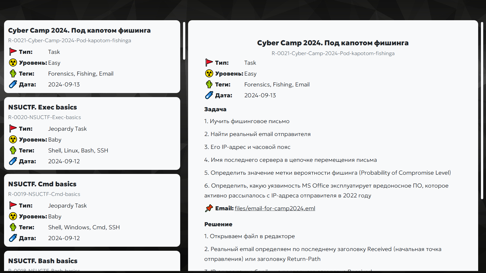

# Desktop Write-Ups Organizer

## Screenshots
### Welcome Page

### Dashboard Page







## Examples
### Report XML
```xml
<?xml version="1.0" encoding="UTF-8"?>
<report>
    <head>
        <name>Simplest CrackMe</name>
        <provider>NSUCTF</provider>
        <type>Jeopardy Task</type>
        <date>14.02.2025</date>
        <level>Baby</level>
        <tags>
            <tag>Reverse</tag>
            <tag>Source Code</tag>
            <tag>C</tag>
    </head>
    <body>
        <task>
            <p>Самый простой CrackMe, который можно придумать: 
            вам дан исходный код, да и сам он не слишком сложный. 
            Найдите корректный ключ и сдайте его как флаг.
            </p>
            <!-- The folder "files" must exist -->
            <file src="files/main.c">Исходный код</file>
        </task>
        <solution>
            <p>Смотрим в код, видим флаг</p>
            <!-- The folder "img" must exist -->
            </img>
            <!-- Preformatted text with escaped HTML-characters -->
            <pre>
#include &#60;stdio.h&#62;
#include &#60;stdlib.h&#62;
#include &#60;string.h&#62;

int main()
{
	char string[1024];
	printf(&#34;Hello, please enter key: &#34;);
	scanf(&#34;%1023[^\n]&#34;, string);
	if (!strcmp(string, &#34;NSU{EzReverse}&#34;))
		printf(&#34;Correct key, congratulations!\n&#34;);
	else
		printf(&#34;Wrong key\n&#34;);
	return 0;
}</pre>
        </solution>
    </body>
</report>
```
